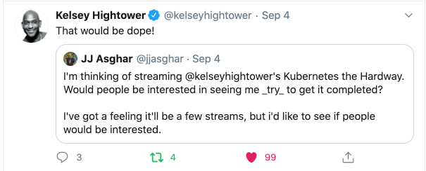

# IBM Cloud - k8s The Hard Way

## Scope

Hi! :wave: Thanks for stopping by. Maybe you knew what this is before coming by; 
or maybe you stumbled onto it. Either way let me take a couple moments to 
explain what this project is.

Recently I was talking with my brother and he mentioned that he was thinking of 
trying out good ol’ [Linux from Scratch][lfs]. I mentioned that it’s one hellva 
endeavor, and more people are doing Kelsey Hightower’s [Kubernetes The Hard Way][k8s]. 
He asked if I had and realized I hadn’t, and he mentioned I should stream it. 
I sent a tweet out not 10 mins later this happened.



Needless to say I spun this project up.

Below should be the YouTube replays of me walking though his project. If you 
came here while I’m still doing this live over September and October of 2020,
you should see the next scheduled stream below and on the [IBM Developer Channel][twitch].

I'll be collecting my notes and anything else I discover in this repository,
I hope this will help someone in the future!

## Calendar

Time: 1400 CDT || 1900 UTC 

|Date|Video|Notes|
|---|---|---|
|Sept 17th| <https://www.youtube.com/watch?v=MiwJeYmaskw> | TBD |
|Sept 24th|   | |
|Oct 1st  |   | |


## License and Author(s)

Author: JJ Asghar <awesome@ibm.com>

If you would like to see a more detailed licence, click [here](./LICENSE).

```text
Copyright:: 2020- IBM, Inc

Licensed under the Apache License, Version 2.0 (the "License");
you may not use this file except in compliance with the License.
You may obtain a copy of the License at

http://www.apache.org/licenses/LICENSE-2.0

Unless required by applicable law or agreed to in writing, software
distributed under the License is distributed on an "AS IS" BASIS,
WITHOUT WARRANTIES OR CONDITIONS OF ANY KIND, either express or implied.
See the License for the specific language governing permissions and
limitations under the License.
```

[k8s]: https://github.com/kelseyhightower/kubernetes-the-hard-way
[lfs]: http://www.linuxfromscratch.org/lfs/
[twitch]: https://twitch.tv/ibmdeveloper
